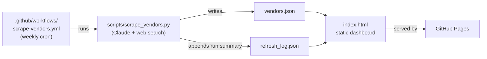

# Vendor Atlas

A self-updating directory of raw training-data vendors for an AI data-annotation company's sourcing team — built as a project for Abaka AI's sourcing team.

**Live dashboard:** https://zzixuan040.github.io/vendor-atlas/ *(enable GitHub Pages on this repo — see below — to activate)*

---

## What it does

A filterable, sortable directory of ~35 real raw-data vendors (image, video, speech, text, sensor/LiDAR, synthetic, geospatial, medical, multilingual) with sourcing-relevant fields per vendor: workforce model, compliance certifications, headcount, notable clients, and a short insight note. Instead of going stale the way a one-off spreadsheet does, the list **refreshes itself weekly**: a scheduled script asks Claude — with live web search — to verify existing entries and surface new vendors, then commits the result straight to this repo.

## Architecture



| File | Purpose |
|---|---|
| [`index.html`](index.html) | The dashboard. Pure static HTML/CSS/JS — no build step, no framework. `fetch()`s `vendors.json` and `refresh_log.json` at load time and renders everything client-side: stat tiles, filters, a sortable table, and a "how this stays current" panel. |
| [`vendors.json`](vendors.json) | The single source of truth. A JSON array of vendor records plus a `generated_at` timestamp. Committed to the repo (not a database) so the whole history is visible in `git log` and every change is a reviewable diff. |
| [`refresh_log.json`](refresh_log.json) | A trailing log (last 20 runs) of what each refresh actually did — vendor count, added/removed/updated, searches used, estimated cost. Powers the history table on the dashboard. |
| [`scripts/scrape_vendors.py`](scripts/scrape_vendors.py) | The refresh logic. Sends the current vendor list to Claude with the web search tool, asks it to spot-check for changes (acquisitions, shutdowns, new certifications) and surface new vendors, then rewrites `vendors.json`. Has built-in cost controls — see below. |
| [`scripts/requirements.txt`](scripts/requirements.txt) | The one dependency (`anthropic`), left unpinned so the weekly run always gets the current SDK. |
| [`.github/workflows/scrape-vendors.yml`](.github/workflows/scrape-vendors.yml) | Runs the script every Monday at 06:00 UTC, and on demand via **Actions → Run workflow** with optional test-mode inputs. Commits `vendors.json`/`refresh_log.json` only if they changed. |

There is no server, no database, and no build pipeline — the dashboard is servable from any static host, and the "backend" is a GitHub Action plus a JSON file. This was a deliberate choice: a sourcing team's vendor list doesn't need real-time infrastructure, and a git-tracked JSON file gives free version history and human-reviewable diffs on every automated change.

## Cost controls for the weekly refresh

Every run of `scrape_vendors.py` prints its own token/search usage and an estimated USD cost **before** touching any file (per [Anthropic's published pricing](https://platform.claude.com/docs/en/agents-and-tools/tool-use/web-search-tool): $10 / 1,000 searches, plus standard per-token rates). A full weekly run — refreshing ~35 vendors and searching for a handful of new ones — typically costs on the order of $1–2.

Two flags make test runs cheap and safe:

```bash
# Cheapest possible smoke test of the whole pipeline: ~a few cents.
ANTHROPIC_API_KEY=sk-ant-... python scripts/scrape_vendors.py --sample 5 --dry-run
```

- **`--dry-run`** — prints the result and its cost; never writes `vendors.json` or `refresh_log.json`. (It does *not* avoid the API cost — the call is already billed by the time you see the estimate. It only protects your files.)
- **`--sample N`** — only sends the first N existing vendors as context, adds none new, and scales the search budget and thinking effort down to match. Even *without* `--dry-run`, a sampled run only ever touches those N vendors in `vendors.json` — everything outside the sample is left untouched, so it's safe to run for real as a small, real, committed test.

The same two controls are exposed as inputs on the GitHub Actions side: **Actions → Refresh vendor data → Run workflow** lets you tick "Dry run", set a sample size, or override the model (e.g. to `claude-sonnet-5` for an even cheaper test) without touching the command line.

For a hard ceiling regardless of what any script estimates, also set a spend limit on your API key or workspace in the [Claude Console](https://platform.claude.com/settings/limits) (Settings → Billing → Limits) — that's a platform-enforced cap, not just a courtesy estimate from this code.

## Running it locally

```bash
git clone https://github.com/zzixuan040/vendor-atlas.git
cd vendor-atlas
python3 -m http.server 8000   # serves index.html + vendors.json
# open http://localhost:8000
```

To actually refresh data, you need an Anthropic API key:

```bash
pip install -r scripts/requirements.txt
ANTHROPIC_API_KEY=sk-ant-... python scripts/scrape_vendors.py --sample 5 --dry-run   # cheap test first
ANTHROPIC_API_KEY=sk-ant-... python scripts/scrape_vendors.py                        # full run
```

## Setting up the automation on a fork

1. **Secret**: repo **Settings → Secrets and variables → Actions** → add `ANTHROPIC_API_KEY`.
2. **Pages**: repo **Settings → Pages** → Source: *Deploy from a branch* → `main` / `(root)`.
3. Optionally trigger **Actions → Refresh vendor data → Run workflow** once to confirm it runs, rather than waiting for Monday.

## Design notes

- **Why a committed JSON file instead of a database?** The refresh is weekly, the dataset is small (dozens, not millions, of rows), and a plain file means every change — including every automated one — shows up as a normal, reviewable git diff. Anyone can see exactly what the bot changed and when.
- **Why merge sampled runs instead of replacing the whole file?** A full run trusts the model's complete output (including omissions, which only happen on verified shutdown evidence per the prompt). A `--sample` run is explicitly a partial, cost-limited pass — merging its output into the existing list instead of replacing wholesale means a cheap test can never accidentally wipe out the other vendors.
- **Why static HTML instead of a framework?** The dashboard is read/filter/sort only — no auth, no write path, no state beyond what's in the JSON. A build step would add nothing here.
- **Why web search over hand-rolled scraping?** Vendor "insight" fields (workforce model, compliance posture, notable clients) aren't reliably extractable from a single page with `requests`/`BeautifulSoup` — they require judgment and cross-referencing multiple sources, which is what the search tool plus the model does per vendor.
