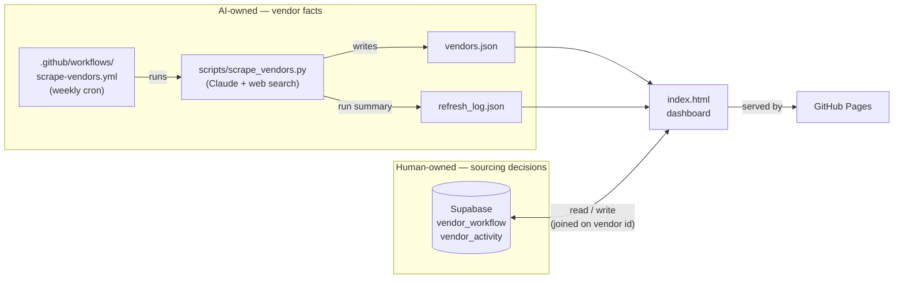

# Vendor Atlas

A shared sourcing workbench for raw training-data vendors — built as a project for Abaka AI's sourcing team.

**Live dashboard:** https://zzixuan040.github.io/vendor-atlas/ *(enable GitHub Pages on this repo — see below — to activate)*

---

## What it does

**The AI owns vendor facts. Humans own sourcing decisions.**

A weekly AI research pass keeps a directory of ~35 real raw-data vendors current (image, video, speech, text, sensor/LiDAR, synthetic, geospatial, medical, multilingual) — workforce model, compliance certifications, headcount, notable clients, and an insight note per vendor. On top of that, the team runs its own sourcing pipeline:

**New → Screening → Shortlisted → Deep Research → Qualified → Engagement**, plus **On Hold** and **Rejected**.

Each vendor carries a persistent **status, owner, priority, notes, next action**, and an append-only **activity history**. Those are human decisions, stored separately from vendor facts, and **a refresh can never overwrite them** — the two live in different stores, so it isn't a matter of careful merging, it's structurally impossible.

## Architecture

Two data domains, deliberately kept in two stores:



The dashboard joins the two on a **stable vendor id**. Nothing in the weekly pipeline can write to the workflow store, and nothing in the browser can write to vendor facts.

| File | Purpose |
|---|---|
| [`index.html`](index.html) | The dashboard. Pure static HTML/CSS/JS — no build step, no framework. Loads `vendors.json` + `refresh_log.json` (facts) and the workflow store (decisions), then renders the pipeline board, filters, sortable table, per-vendor workflow panel, and activity history. |
| [`vendors.json`](vendors.json) | Vendor facts — the AI-owned half. A JSON array of vendor records plus a `generated_at` timestamp. Committed to the repo (not a database) so the whole history is visible in `git log` and every change is a reviewable diff. |
| [`config.js`](config.js) | Where you paste your Supabase project URL + anon key to turn on team sync. Blank by default; the app then runs in clearly-labelled local-only mode. |
| [`supabase-setup.sql`](supabase-setup.sql) | One-shot schema for the workflow store: `vendor_workflow` + `vendor_activity`, with RLS policies. Run it once in the Supabase SQL editor. |
| [`refresh_log.json`](refresh_log.json) | A trailing log (last 20 runs) of what each refresh actually did — vendor count, added/removed/updated, searches used, estimated cost. Powers the history table on the dashboard. |
| [`scripts/scrape_vendors.py`](scripts/scrape_vendors.py) | The refresh logic. Sends the current vendor list to Claude with the web search tool, asks it to spot-check for changes (acquisitions, shutdowns, new certifications) and surface new vendors, then rewrites `vendors.json`. Resolves stable ids and archives rather than deletes — see *Refresh safety*. Has built-in cost controls — see below. |
| [`scripts/requirements.txt`](scripts/requirements.txt) | The one dependency (`anthropic`), left unpinned so the weekly run always gets the current SDK. |
| [`.github/workflows/scrape-vendors.yml`](.github/workflows/scrape-vendors.yml) | Runs the script every Monday at 06:00 UTC, and on demand via **Actions → Run workflow** with optional test-mode inputs. Commits `vendors.json`/`refresh_log.json` only if they changed. |

The dashboard is servable from any static host, and the facts "backend" is a GitHub Action plus a JSON file. This was a deliberate choice: a sourcing team's vendor list doesn't need real-time infrastructure, and a git-tracked JSON file gives free version history and human-reviewable diffs on every automated change.

## Team workflow state

Workflow state is the one thing a static site genuinely can't hold on its own, so it gets the smallest real backend that works: two Supabase tables, read and written directly over REST (no SDK, no build step, ~90 lines in `index.html`).

**Setup (about two minutes):**

1. Create a free project at [supabase.com](https://supabase.com).
2. Run [`supabase-setup.sql`](supabase-setup.sql) in the project's SQL editor.
3. Paste the Project URL and the **anon/public** key into [`config.js`](config.js), then commit and push.

Until you do that, the app runs in **local-only mode** — fully functional, but workflow changes stay in that one browser and a banner says so. Once configured, the banner turns green and the whole team shares one board.

**Identity** is deliberately minimal: you type your name once (kept in `localStorage`) and it's used for vendor ownership and as the actor on activity entries. There is no login — the brief excludes authentication, and this is an internal prototype.

**Security tradeoff, stated plainly:** with no login, anyone who can open the dashboard can change workflow state. Vendor facts aren't writable from the browser at all (they live in git), so the blast radius is workflow fields only, and every change is recorded in `vendor_activity`. Add Supabase Auth and per-user policies before putting anything sensitive in here.

## Refresh safety

The weekly refresh must never undo a human decision. Three things make that true:

1. **Separate stores.** Vendor facts live in `vendors.json` (git); status/owner/priority/notes/next action live in Supabase. The refresh script has no credentials for, and no code path to, the workflow store.
2. **Stable vendor ids.** Workflow rows are keyed on a vendor id, so that id has to survive a rename. `resolve_id()` matches an incoming vendor to an existing one **by domain first**, then by name slug, and only mints a new id for a genuinely new company. This is not hypothetical: the first live refresh renamed *Centific* to *"Centific (formerly Pactera EDGE, incl. OneForma)"*, and a name-derived id changed silently with it.
3. **Archive, never delete.** If a full refresh omits a vendor, the record is kept and flagged `archived: true` rather than dropped — so a vendor someone had already rejected or put on hold doesn't vanish along with the decision about it. A later refresh that re-discovers it clears the flag. Sampled (`--sample`) runs never archive anything, since they only looked at part of the list.

A newly discovered vendor needs no special handling: the dashboard treats "no workflow row" as `New / Unassigned / Medium / empty`, so defaults cost nothing to store.

## Cost controls for the weekly refresh

Every run of `scrape_vendors.py` prints its own token/search usage and an estimated USD cost **before** touching any file (per [Anthropic's published pricing](https://platform.claude.com/docs/en/agents-and-tools/tool-use/web-search-tool): $10 / 1,000 searches, plus standard per-token rates). A full weekly run — refreshing ~35 vendors and searching for a handful of new ones — typically costs on the order of $1–2.

Two flags make test runs cheap and safe:

```bash
# Cheapest possible smoke test of the whole pipeline: ~a few cents.
ANTHROPIC_API_KEY=sk-ant-... python scripts/scrape_vendors.py --sample 5 --dry-run
```

- **`--dry-run`** — prints the result and its cost; never writes `vendors.json` or `refresh_log.json`. (It does *not* avoid the API cost — the call is already billed by the time you see the estimate. It only protects your files.)
- **`--sample N`** — only sends the first N existing vendors as context, adds none new, and scales the search budget and thinking effort down to match. Even *without* `--dry-run`, a sampled run only ever touches those N vendors in `vendors.json` — everything outside the sample is left untouched, so it's safe to run for real as a small, real, committed test.

The same two controls are exposed as inputs on the GitHub Actions side: **Actions → Refresh vendor data → Run workflow** lets you tick "Dry run", set a sample size, or override the model (e.g. to `claude-sonnet-5` for an even cheaper test) without touching the command line.

For a hard ceiling regardless of what any script estimates, also set a spend limit on your API key or workspace in the [Claude Console](https://platform.claude.com/settings/limits) (Settings → Billing → Limits) — that's a platform-enforced cap, not just a courtesy estimate from this code.

## Running it locally

```bash
git clone https://github.com/zzixuan040/vendor-atlas.git
cd vendor-atlas
python3 -m http.server 8000   # serves index.html + vendors.json
# open http://localhost:8000
```

To actually refresh data, you need an Anthropic API key:

```bash
pip install -r scripts/requirements.txt
ANTHROPIC_API_KEY=sk-ant-... python scripts/scrape_vendors.py --sample 5 --dry-run   # cheap test first
ANTHROPIC_API_KEY=sk-ant-... python scripts/scrape_vendors.py                        # full run
```

## Setting up the automation on a fork

1. **Secret**: repo **Settings → Secrets and variables → Actions** → add `ANTHROPIC_API_KEY`.
2. **Pages**: repo **Settings → Pages** → Source: *Deploy from a branch* → `main` / `(root)`.
3. Optionally trigger **Actions → Refresh vendor data → Run workflow** once to confirm it runs, rather than waiting for Monday.

## Design notes

- **Why a committed JSON file instead of a database?** The refresh is weekly, the dataset is small (dozens, not millions, of rows), and a plain file means every change — including every automated one — shows up as a normal, reviewable git diff. Anyone can see exactly what the bot changed and when.
- **Why merge sampled runs instead of replacing the whole file?** A full run trusts the model's complete output (including omissions, which only happen on verified shutdown evidence per the prompt). A `--sample` run is explicitly a partial, cost-limited pass — merging its output into the existing list instead of replacing wholesale means a cheap test can never accidentally wipe out the other vendors.
- **Why static HTML instead of a framework?** The whole app is one file of vanilla JS with two `fetch` targets. A build step would add ceremony without removing any real complexity.
- **Why Supabase rather than storing workflow state in git too?** Writing to git from a browser needs a token per teammate, and every status change would become a commit and a Pages rebuild — slow, and a conflict magnet. Workflow state changes many times a day; vendor facts change once a week. Different write patterns, different stores.
- **Why does the pipeline count treat "no row" as New?** So a vendor is never in limbo. Every vendor has an effective status from the moment it's discovered, without the refresh needing write access to the workflow store to seed defaults.
- **Why web search over hand-rolled scraping?** Vendor "insight" fields (workforce model, compliance posture, notable clients) aren't reliably extractable from a single page with `requests`/`BeautifulSoup` — they require judgment and cross-referencing multiple sources, which is what the search tool plus the model does per vendor.
